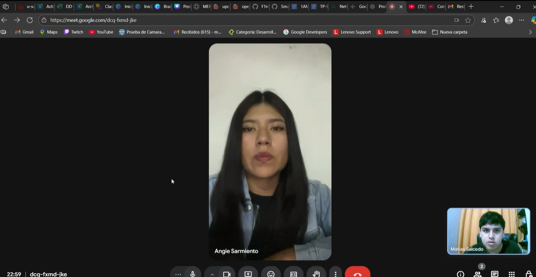

# EcoCrop

Product: SmartCrop 

# UNIVERSIDAD PERUANA DE CIENCIAS APLICADAS

## Ingeniería de Software

## 5to ciclo

## Desarrollo de Aplicaciones Open Source

### **Sección:** 7357

### **Profesor:** Rafael Oswaldo Castro Veramendi

### Informe de Trabajo Final

### "EcoCrop"

### "SmartCrop"

### **Integrantes:**

- Ivan Fernando Sanchez Guevara - u202218181
- 
- 
- 

### agosto, 2025

**Url del proyecto**: https://github.com/SmartCrop-EcoCrop?view_as=public

## Registro de Versiones del Informe

| Version | Fecha    | Autor          | Descripción                                                                                                                                                                                                                               |
|---------|----------|----------------|-------------------------------------------------------------------------------------------------------------------------------------------------------------------------------------------------------------------------------------------|
| TB1     |  |    | Creación organización y repositorios en GitHub para proyecto final                                                                                                                                                                        |
| TB1     | 13/09/25 | Fernando Sanchez    | Desarrollo del Capitulo 1 del informe                                                                                                                                                                                                     | 
| TB1     |  |     | Documentación completa (5.2.1 -  5.2.1.8)                                                                                                                                                                                                 | 
| TB1     |  |         | Desarrollo del Capitulo 3 del informe 4.8
       

## Project Report Collaboration Insights

|  URL de la organización del proyecto  |             URL del repositorio del reporte          |
| :-----------------------------------: |:----------------------------------------------------:| 
| (link del todo) | link(repo) |

|          URL del repositorio de la landing page           |
|:---------------------------------------------------------:|
| link(landing page) |

|          URL del repositorio del frontend          |
|:---------------------------------------------------------:|
|   |

|          URL del repositorio del backend          |
|:---------------------------------------------------------:|
|   |

## Contenido

## Tabla de contenidos

- [Registro de Versiones del Informe](#registro-de-versiones-del-informe)
- [Project Report Collaboration Insights](#project-report-collaboration-insights)
- [Student Outcome](#student-outcome)
- [Capítulo I: Introducción](#capítulo-i-introducción)
    - [1.1. Startup Profile](#11-startup-profile)
        - [1.1.1. Descripción de la Startup](#111-descripción-de-la-startup)
        - [1.1.2. Perfiles de integrantes del equipo](#112-perfiles-de-integrantes-del-equipo)
    - [1.2. Solution Profile](#12-solution-profile)
        - [1.2.1. Antecedentes y problemática](#121-antecedentes-y-problemática)
        - [1.2.2. Lean UX Process](#122-lean-ux-process)
        - [1.2.2.1. Lean UX Problem Statements](#1221-lean-ux-problem-statements)
        - [1.2.2.2. Lean UX Assumptions](#1222-lean-ux-assumptions)
        - [1.2.2.3. Lean UX Hypothesis Statements](#1223-lean-ux-hypothesis-statements)
        - [1.2.2.4. Lean UX Canvas](#1224-lean-ux-canvas)
    - [1.3. Segmentos objetivos](#13-segmentos-objetivo)
- [Capítulo II: Requirements Elicitation \& Analysis](#capítulo-ii-requirements-elicitation--analysis)
    - [2.1. Competidores](#21-competidores)
        - [2.1.1. Análisis competitivo](#211-análisis-competitivo)
        - [2.1.2. Estrategias y tácticas frente a competidores](#212-estrategias-y-tácticas-frente-a-competidores)
    - [2.2. Entrevistas](#22-entrevistas)
        - [2.2.1. Diseño de entrevistas](#221-diseño-de-entrevistas)
        - [2.2.2. Registro de entrevistas](#222-registro-de-entrevistas)
        - [2.2.3. Análisis de entrevistas](#223-análisis-de-entrevistas)
    - [2.3. Needfinding](#23-needfinding)
        - [2.3.1. User Personas](#231-user-personas)
        - [2.3.2. User Task Matrix](#232-user-task-matrix)
        - [2.3.3. User Journey Mapping](#233-user-journey-mapping)
        - [2.3.4. Empathy Mapping](#234-empathy-mapping)
        - [2.3.5. As-is Scenario Mapping](#235-as-is-scenario-mapping)
    - [2.4. Ubiquitous Language](#24-ubiquitous-language)
- [Capítulo III: Requirements Specification](#capítulo-iii-requirements-specification)
    - [3.1. To-Be Scenario Mapping](#31-to-be-scenario-mapping)
    - [3.2. User Stories](#32-user-stories)
    - [3.3. Impact Mapping](#33-impact-mapping)
    - [3.4. Product Backlog](#34-product-backlog)
- [Capítulo IV: Product Design](#capítulo-iv-product-design)
    - [4.1. Style Guidelines.](#41-style-guidelines)
        - [4.1.1. General Style Guidelines](#411-general-style-guidelines)
        - [4.1.2. Web Style Guidelines](#412-web-style-guidelines)
    - [4.2. Information Architecture](#42-information-architecture)
        - [4.2.1. Organization Systems](#421-organization-systems)
        - [4.2.2. Labeling Systems](#422-labeling-systems)
        - [4.2.3. SEO Tags and Meta Tags](#423-seo-tags-and-meta-tags)
        - [4.2.4. Searching Systems](#424-searching-systems)
        - [4.2.5. Navigation Systems](#425-navigation-systems)
    - [4.3. Landing Page UI Design](#43-landing-page-ui-design)
        - [4.3.1. Landing Page Wireframe](#431-landing-page-wireframe)
        - [4.3.2. Landing Page Mock-up](#432-landing-page-mock-up)
    - [4.4. Web Applications UX/UI Design](#44-web-applications-uxui-design)
        - [4.4.1. Web Applications Wireframes](#441-web-applications-wireframes)
        - [4.4.2. Web Applications Wireflow Diagrams](#442-web-applications-wireflow-diagrams)
        - [4.4.3. Web Applications Mock-ups](#443-web-applications-mock-ups)
        - [4.4.4. Web Applications User Flow Diagrams](#444-web-applications-user-flow-diagrams)
    - [4.5. Web Applications Prototyping](#45-web-applications-prototyping)
    - [4.6. Domain-Driven Software Architecture](#46-domain-driven-software-architecture)
        - [4.6.1. Software Architecture Context Diagram](#461-software-architecture-context-diagram)
        - [4.6.2. Software Architecture Container Diagrams](#462-software-architecture-container-diagrams)
        - [4.6.3. Software Architecture Components Diagrams](#463-software-architecture-components-diagrams)
    - [4.7. Software Object-Oriented Design](#47-software-object-oriented-design)
        - [4.7.1. Class Diagrams](#471-class-diagrams)
    - [4.8. Database Design](#48-database-design)
        - [4.8.1. Database Diagram](#481-database-diagram)
        - [4.8.2. Database Dictionary](#482-database-dictionary)
- [Capítulo V: Product Implementation, Validation \& Deployment](#capítulo-v-product-implementation-validation--deployment)
    - [5.1. Software Configuration Management](#51-software-configuration-management)
        - [5.1.1. Software Development Environment Configuration](#511-software-development-environment-configuration)
        - [5.1.2. Source Code Management](#512-source-code-management)
        - [5.1.3. Source Code Style Guide \& Conventions](#513-source-code-style-guide--conventions)
        - [5.1.4. Software Deployment Configuration](#514-software-deployment-configuration)
    - [5.2. Landing Page, Services \& Applications Implementation](#52-landing-page-services--applications-implementation)
        - [5.2.1. Sprint 1](#521-sprint-1)
            - [5.2.1.1. Sprint Planning 1](#5211-sprint-planning-1)
            - [5.2.1.2. Sprint Backlog 1](#5212-sprint-backlog-1)
            - [5.2.1.3. Development Evidence for Sprint Review](#5213-development-evidence-for-sprint-review)
            - [5.2.1.4. Testing Suite Evidence for Sprint Review](#5214-testing-suite-evidence-for-sprint-review)
            - [5.2.1.5. Execution Evidence for Sprint Review](#5215-execution-evidence-for-sprint-review)
            - [5.2.1.6. Services Documentation Evidence for Sprint Review](#5216-services-documentation-evidence-for-sprint-review)
            - [5.2.1.7. Software Deployment Evidence for Sprint Review](#5217-software-deployment-evidence-for-sprint-review)
            - [5.2.1.8. Team Collaboration Insights during Sprint](#5218-team-collaboration-insights-during-sprint)
        - [5.2.2. Sprint 2](#522-sprint-1)
            - [5.2.2.1. Sprint Planning 1](#5221-sprint-planning-1)
            - [5.2.2.2. Sprint Backlog 1](#5222-sprint-backlog-1)
            - [5.2.2.3. Development Evidence for Sprint Review](#5223-development-evidence-for-sprint-review)
            - [5.2.2.4. Testing Suite Evidence for Sprint Review](#5224-testing-suite-evidence-for-sprint-review)
            - [5.2.2.5. Execution Evidence for Sprint Review](#5225-execution-evidence-for-sprint-review)
            - [5.2.2.6. Services Documentation Evidence for Sprint Review](#5226-services-documentation-evidence-for-sprint-review)
            - [5.2.2.7. Software Deployment Evidence for Sprint Review](#5227-software-deployment-evidence-for-sprint-review)
            - [5.2.2.8. Team Collaboration Insights during Sprint](#5228-team-collaboration-insights-during-sprint)
        - [5.2.3. Sprint 3](#523-sprint-3)
            - [5.2.3.1. Sprint Planning 3](#5231-sprint-planning-3)
            - [5.2.3.2. Sprint Backlog 3](#5232-sprint-backlog-3)
            - [5.2.3.3. Development Evidence for Sprint Review](#5233-development-evidence-for-sprint-review)
            - [5.2.3.4. Testing Suite Evidence for Sprint Review](#5234-testing-suite-evidence-for-sprint-review)
            - [5.2.3.5. Execution Evidence for Sprint Review](#5235-execution-evidence-for-sprint-review)
            - [5.2.3.6. Services Documentation Evidence for Sprint Review](#5236-services-documentation-evidence-for-sprint-review)
            - [5.2.3.7. Software Deployment Evidence for Sprint Review](#5237-software-deployment-evidence-for-sprint-review)
            - [5.2.3.8. Team Collaboration Insights during Sprint](#5238-team-collaboration-insights-during-sprint)
        - [5.2.4. Validation Interviews](#524-validation-interviews)
          - [5.2.4.1. Diseño de Entrevistas](#5241-diseño-de-entrevistas)
          - [5.2.4.2. Registro de Entrevistas](#5242-registro-de-entrevistas)
          - [5.2.4.3. Evaluaciones según heurísticas](#5243-evaluaciones-según-heurísticas)
        
        - [5.2.5. Video About-the-Team](#525-video-about-the-team)
        - [5.2.6. Video About-the-Product](#526-video-about-the-product)
- [Conclusiones](#conclusiones)
- [Bibliografía](#bibliografía)
- [Anexos](#anexos)

## Student Outcome

_ABET – EAC - Student Outcome 5_

**Criterio:**  Capacidad de comunicarse efectivamente con un rango de audiencias.

En el siguiente cuadro se describe las acciones realizadas y enunciados de
conclusiones por parte del grupo, que permiten sustentar el haber alcanzado el logro
del ABET – EAC - Student Outcome 3.

 | Criterio especifico                                                          | Acciones Realizadas                                                                                                                                                                                                                                                                                                                                                                                                                                                             | Conclusiones |
| :--------------------------------------------------------------------------- | :------------------------------------------------------------------------------------------------------------------------------------------------------------------------------------------------------------------------------------------------------------------------------------------------------------------------------------------------------------------------------------------------------------------------------------------------------------------------------ | ----------- |
| 1. Comunica oralmente con efectividad a diferentes rangos de audiencia. | ** **   TB: .    **Ivan Fernando Sanchez Guevara**   TB: Durante el desarrollo del avance estuvimos pendientes de la información y percances que tuvo cada miembro, permitiendo tener una mejor organización a la hora de solucionar los temas y realizar poder realizar todas las actividades en el tiempo indicado.    ** **   TB:     ** **   TB:    | ** **   TB:   **Ivan Fernando Sanchez Guevara**   TB: El aprendizaje obtenido durante el trabajo de este entregable es de la gran importancia de tener una comunicación fluida y persistente con mi equipo para la distribucion de deberes, plantear las reuniones con todos entre otras cosas. sin olvidar de siempre mantener un orden como tener organización al respecto.   ** **   TB:    ** **   TB:   | ** **   TB:    ** **   TB:    ** **   TB:    ** **   TB:    |
| 2. Comunica por escrito con efectividad a diferentes rangos de audiencia | ** **   TB:    **Ivan Fernando Sanchez**  TB: Gracias al feedback recibida de los usuarios nos ayudo a realizar una mejora respecto al proyecto tanto como equipo del proyecto como desarrolladores de Software al poder complacer las principales necesidades de nuestros usuarios.    ** **   TB:     ** **  TB:    | ** **   TB:      **Ivan Fernando Sanchez Guevara**  TB: Por medio del desarrollo del trabajo parcial, pude comprender la importancia de identificar una solución innovadora como efectivamente implementada pud, refugios e incluso adoptantes los cuales necesitaban una solución fresca la cual sirva para optimizar su labor diaria y poder expanderse a nuevos rumbos.    ** **   TB:    ** **   TB:   |

## Capítulo I: Introducción

### 1.1. Startup Profile

#### 1.1.1. Descripción de la Startup

Somos EcoCrop, una empresa nacida por la union de estudiantes de la Universidad Peruana de Ciencias Aplicadas (UPC), dedicada a moldear la agricultura a través de la tecnología. Nuestra misión es mejorar la calidad y cantidad de la producción de empresas agrícolas mediante el desarrollo de soluciones digitales. Nuestro producto es una aplicación webb, llamada SmartCrop, que utiliza tecnologia IoT para el procesamiento de imágenes para identificar plagas de cultivos como tambien implementar sensores para medir la temperatura y ayudar a los agricultores a evitar que sus cultivos se marchiten.
La aplicación SmartCrop permite a los agricultores estar al tanto de sus cultivos con camaras istaladas para tener una imágenes de cultivos, identificar automáticamente las plagas existentes en tiempo real, Medir la temperatura de la zona de cultivos para monitorear si necesitan ser movidas por bajas temperaturas o cubrirlas por exceso de sol o altas temperaturas, y sin olvidar el recibir información detallada sobre el huerto, así como guías prácticas y medidas de control recomendadas. SmartCrop ayuda con el control activo de plagas, como medicion de temperatura y promueve un uso más eficaz y sostenible de los recursos agrícolas.
Además, nuestra aplicación proporciona actualizaciones en tiempo real sobre métodos de control de plagas,recomendaciones para temperaturas altas o bajas, facilita el contacto con empresas especializadas en el control de plagas, informe meteolologico confiable y proporciona una red de agricultores para compartir sus conocimientos. Todo esto se hace a través de una interfaz intuitiva y herramientas para optimizar la producción agrícola.

**Misión:**

Nuestra misión es Moldear la agricultura a por medio de la tecnología para mejorar la calidad y la producción agrícola. Trabajamos para elaborar soluciones digitales innovadoras que permitan facilitar a los agricultores como identificar y controlar eficazmente las plagas como el estado del clima, promoviendo así la sostenibilidad y el uso responsable de los recursos agrícolas.

**Visión:**

Nuestra visión es ser el principalmente un soporte para los agricultores, promoviendo una agricultura más efectiva y rapida como sostenible. Nuestro objetivo es construir un ecosistema agrícola que abarque todo el mundo donde el conocimiento y las herramientas digitales mejoren la resguarden el medio ambiente, productividad y garanticen la seguridad respecto a la alimencion.

#### 1.1.2. Perfiles de integrantes del equipo

| 
Foto
 | 
Descripción
 |
|------|-------------|
| 
 
 |  |
| 

 | Mi Nombre es Fernando Sanchez Guevara, tengo 21 años, actualmente me encuentro en el quinto ciclo de la carrera de Ingeniería de Software. Me considero alguien disiplinado respecto con la puntualidad y desarrollar de la mejor manera los deberes asignados. Ademas, me preocupo por mi equipo, tratando de que no tengan ningun problema respecto al trabajo, y darles la mano para poder ayudar cuando lo necesiten. | 
| 

  |                                                                                                                                          |
| 

         | |

### 1.2. Solution Profile

En esta sección, se va a presentar en gran detalle el perfil de la solución, sustentado por un sólido fundamento de antecedentes y desarrollado de manera metódica, siguiendo el proceso de Lean UX.

#### 1.2.1. Antecedentes y problemática

La agricultura es una actividad económica fundamental a nivel mundial, representando el sustento de millones de personas. No obstante, uno de los desafíos más persistentes que enfrentan los agricultores es el manejo de plagas como los cambios de temperatura, que puede tener un impacto devastador en la producción de cultivos. Se estima que entre el 20% y el 40% de la producción mundial de cultivos se pierde anualmente debido a las plagas y enfermedades,como tambien que entre el 5% a 7.5% es perdidas por los cambios de la temperatura bajas y altas, lo que resulta en pérdidas económicas de un estimado de $220 mil millones al año (La Organización de las Naciones Unidas para la Alimentación y la Agricultura [FAO], 2020).
El impacto de las plagas como el cambio de clima es particularmente grave en regiones en desarrollo, donde el acceso a herramientas y conocimientos adecuados para la identificación y control de plagas o notificacion del estado actual del clima en tiempo real es limitado. En América Latina, por ejemplo, la falta de tecnologías avanzadas para el manejo de plagas sigue siendo un obstáculo significativo para el crecimiento agrícola. Un informe de la Comisión Económica para América Latina y el Caribe (CEPAL) destaca que la implementación de soluciones tecnológicas en la agricultura es clave para aumentar la productividad y sostenibilidad del sector (CEPAL, 2023).
Asimismo, un artículo de la empresa Badische Anilin und Soda Fabrik (BASF) hacia la empresa América Latina indica que explorar tecnologia nuevas permitira la mejora en el campo y ayudara a preparase respecto a eventualidades que lleguen a surgir en la agricultura como repercucion del cambio climático(BASF, 2024)

El uso de tecnologías IoT como el procesamiento de imágenes por camara de video, sensores de temperatura y la inteligencia artificial en la agricultura ha mostrado un gran potencial para transformar el manejo de plagas y lidiar con los cambios climaticos. La capacidad de identificar plagas de manera precisa y rápida permite a los agricultores tomar decisiones informadas y aplicar medidas de control antes de que las infestaciones se extiendan, sin olvidar que las notificaciones sobre el cambio climatico ayuda a poder cuidar a las plantas de la mejor forma posible. Un estudio realizado por el Instituto Internacional de Investigación sobre Políticas Alimentarias (IFPRI) indica que el uso de tecnologías digitales en la agricultura puede reducir las pérdidas por plagas en un 30% y mejorar la eficiencia del uso de pesticidas en un 25% (IFPRI, 2021).
Por otro lado, un estudio del Grupo Banco Mundial (GBM) indica que por medio de Asociación Internacional de Fomento (AIF) que se deberia continuar desarrollando e implementando las mediciones e indicadores en la agricultura para determinar los efectos directos y contabilizar las emisiones de GEI respecto a los proyectos y operaciones(GBM,2025).
Lastimosamente a pesar de dichos avances, el acceder a estas tecnologías sigue estando limitado respecto a muchos pequeños y medianos agricultores, quienes constituyen la mayor parte de la fuerza laboral agrícola en países como Perú. La falta de acceso a herramientas avanzadas de diagnóstico, temperantura actual del clima, y la dependencia de métodos tradicionales de manejo de plagas exacerban los problemas, poniendole un limite la capacidad de estos agricultores para aumentar su productividad y asegurar la sostenibilidad de sus cultivos.

**What?**
 
*¿Cual es el problema?*
 
Los agricultores enfrentan dificultades para identificar, controlar y cuidar respecto a las plagas y los cambios de temperatura, lo que lleva a pérdidas significativas en sus cultivos y al uso ineficaz de recursos, como pesticidas o anemómetro antiguos.
 

*¿Cual es la relacion con la persona en cuestion?* 
Los agricultores dependen mucho de sus cultivos para su sustento, por eso la aplicación SmartCrop les ofrece una herramienta accesible para poder identificar las plagas como cambios de clima y recibir recomendaciones de control.
 

**Why?**
  
*¿Cual es la causa del problema?* 
El principal problema radica en la falta o dificil acceso a herramientas tecnológicas avanzadas y conocimientos especializados para la identificación respecto al control de plagas y cambios climaticos. Muchos agricultores por necesidad usan métodos antiguos y manuales, que ah dia de hoy son ineficientes y a otras veces imprecisos, lo que da resultado en un mal manejo  de las plagas y control de clima lo que da pie a pérdidas significativas respecto a la producción agrícola.
 

**When?**
  
*¿Cuando sucede el problema?* 
El problema ocurre desde cualquier etapa referente al ciclo de cultivo, especialmente durante el crecimiento y maduración, cuando las plagas pueden causar más daño o cuando hay cambios imprevistos en la temperatura.
 

*¿Cuando utiliza el cliente el producto?* 
Los agricultores usan la aplicación cuando detectan síntomas de plagas o desean prevenir infestaciones,cambios de temperatura repentinos o climas extremos, así como para monitorear regularmente la salud de sus cultivos.
 

**Where?**
 
*¿Dónde está el cliente cuando usa el producto?* 
El cliente utiliza la aplicación en el campo, directamente en sus cultivos, donde puede capturar imágenes de las plantas afectadas.
 
*¿A dónde se dirige?* 
El agricultor se dirige a un diagnóstico preciso y a la implementación de medidas de control efectivas para proteger sus cultivos.

 
*¿Dónde surge el problema?* 
El problema surge en los campos de cultivo, donde las plagas atacan las plantas y los agricultores carecen de herramientas efectivas para manejarlas.

 

**Who?**
  
*¿Quiénes están involucrados?* 
Los principales involucrados son los agricultores, pero también incluyen a meteorólogos experimentados,noticieros, expertos en plagas, empresas de control de plagas, y desarrolladores de tecnología.
 

*¿A quiénes le sucede el problema?* 
El problema afecta a los agricultores, sobre todo a los que tienen recursos limitados para acceder a soluciones avanzadas respecto a manejo de plagas y cambios de clima.
 

*¿Quién lo utilizará?* 
La aplicación será utilizada por agricultores de todos los tamaños que buscan mejorar el manejo de sus cultivos, así como por consultores agrícolas y cooperativas.
 

**How?**
  
*¿En qué condiciones los clientes usan nuestro producto?* 
Los clientes usan la aplicación web SmartCrop en el campo, cuando los diapositivos IoT como camaras y sensor de temperatura y detectan posibles pagas por medio de las camaras, o vean que las temperatura cambia a niveles peligrosos. La aplicación webb les notificara con imagenes, alertara en caso que la temperatura suba o baje en niveles peligrosos, como recibir diagnósticos y recomendaciones en tiempo real, facilitando una respuesta precisa y eficaz.
 

*¿Cómo nos conocieron los compradores?* 
Los compradores conocen SmartCrop a través de promociones por medio de redes sociales,noticias de la TV, colaboraciones con cooperativas agrícolas, recomendaciones de expertos en plagas como mmeteorologia y ferias agrícolas donde se presenta la tecnología.
 

*¿Cómo prefieren los lectores acceder a nuestro contenido?* 
Los agricultores prefieren acceder a contenido relevante y actualizado directamente en su aplicacion web por medio de una computadora dada por el gobierno o una laptop conectado a internet, con acceso a guías prácticas y notificaciones sobre métodos de control de plagas o protocolos durante cambios climaticos.
 

*¿Qué llevó a la persona a llegar a esta situación?* 
La escases de herramientas eficientes para identificar y controlar las plagas o el cambio respecto al clima llevó a los agricultores a buscar soluciones tecnológicas que les permitan mejorar la gestión de sus cultivos y reducir pérdidas económicas.
 

**How much?**
 
*¿Cuánto afecta este problema a los usuarios?* 
Se estima que entre el 20% y el 40% de la producción mundial de cultivos se pierde anualmente debido a plagas y enfermedades como el 5% y 7.5% son perdidas por el cambio climatico, con pérdidas económicas globales de alrededor de $220 mil millones al año (FAO, 2020).
En América Latina, el 60% de los agricultores pequeños y medianos tienen un acceso limitado a tecnologías avanzadas para el manejo de plagas y gestionar el comportamiento de la temperatura, lo que contribuye a una baja eficiencia en el control de infestaciones o marchitacion de la cocecha (CEPAL, 2022).
 

*¿Cuánto cuesta realizar el proyecto?* 
Hostinger, estima que el costo promedio para el desarrollo de una aplicación webb es de S/. 20.000.
 

#### 1.2.2. Lean UX Process

El proceso Lean UX se acopla muy bien a startups como otros metodos que buscan crear soluciones innovadoras y efectivas en el mercado. Este enfoque se caracteriza por su gran agilidad y centrado hacia el usuario, lo que significa que estamos constantemente buscando el poder validar las nuestras ideas y prototipos con los usuarios para poder garantizar que estamos sobrellevando sus necesidades de todas las maneras posibles.

##### 1.2.2.1. Lean UX Problem Statements

La productividad agrícola está siendo amenazada constantemente por las infestaciones de plagas y cambios climaticos, lo que da como resultado en la pérdida de cultivos y disminucion de ingresos para los agricultores. A pesar de los avances tecnológicos, tanto varios agricultores pequeños y medianos, especialmente en regiones en desarrollo como América Latina, enfrentan dificultades para acceder e implementar soluciones avanzadas para el manejo de plagas y el cambio climatico. Estas limitaciones da como resultado en un uso deficiente de recursos y menores rendimientos agrícolas. El problema se intencifica debido a la falta de herramientas precisas y en tiempo real para la identificación de plagas como el monitorio de la temperatura, lo que lleva a tratamientos retrasados e incorrectos. En regiones como América Latina, más del 60% de los pequeños y medianos agricultores carecen de acceso a tecnologías avanzadas para el manejo de plagas y sin olvidar tambien la problematica de la temperatura, lo que da paso a la ineficiencia y menor productividad (AgroScience Today, 2023).
Estado actual del mercado: La agricultura en América Latina sigue siendo afectada por pérdidas significativas debido a plagas como el cambio de temperatura, con una carencia de acceso a herramientas tecnológicas avanzadas que permitan un control más preciso y sostenible. Las soluciones de hoy en dia fallan en adaptarse a las necesidades locales, dejando a los agricultores con muy pocas opciones efectivas para mejorar su manejo de plagas o persivir el cambio de clima.
Oportunidad a aprovechar: SmartCrop es una aplicación webb que utiliza inteligencia artificial, tecnologias IoT y algoritmos de reconocimiento de imágenes por camara para identificar y gestionar plagas en cultivos de manera eficiente, como tambien tener sensores de temperatura para indicar en tiempo real los cambios imprevistos. Donde varias soluciones fallan en adaptarse a las condiciones reales del campo y las necesidades específicas de los agricultores, SmartCrop busca simplificar el manejo de plagas y cambios de temperatura con una herramienta accesible y fácil de usar que otorgan varias recomendaciones prácticas y precisas.
Problemáticas desde la perspectiva de cada segmento:
Agricultores: Enfrentan muy frecuentemente varias pérdidas significativas debido a la falta de acceso a tecnologias avanzadas y soluciones efectivas para el manejo de plagas o identificar los cambios en la temperatura, afectando su productividad y sostenibilidad.
Cooperativas y asociaciones agrícolas: Necesitan soluciones moldeables que permitan a sus miembros organizar y gestionar mejor sus cultivos y mantenerse competitivos, pero las herramientas que tienen a su disponibilidad no son adecuadas respecto a sus necesidades específicas.
Empresas de insumos agrícolas: Deben innovarse continuamente para ofrecer los productos más efectivos y sostenibles posibles, pero enfrentan dificultades para adaptarse al ritmo de las demandas del mercado como tambien a las necesidades tecnológicas de los agricultores.
Restricciones: El proyecto debe considerar ciertas limitaciones como la conectividad en zonas rurales, la capacitación de usuarios con bajos niveles respecto a las nuevas tecnológica, y la necesidad de ofrecer una solución rentable y adaptable a diferentes tipos de cultivos y condiciones climáticas.

Por eso nuestra plataforma se enfoca en mejorar la usbilidad y gestion de los campos con cultivos respecto a las plagas y cambio de temperatura. Ofrecemos un sistema que centraliza la información disponible sobre cada el estado actual de los cultivos y cambios de temperatura, facilitando la toma de decisiones para que los agricultores puedan cuidar sus cultivos de forma excelente. Aunque no contamos con acceso a las noticias del pais como grandes cantidades de expertos, recopilamos y compartimos la información disponible sobre el monitoreo y identificacion de anomalias, lo que ayuda a los agricultores a tomar seguir los protocolos que se gestionen con dicha informacion.

Lo que nos distingue es el poder proporcionar herramientas prioritarias y intuitivas, proporcionando los detalles claros y comprensibles sobre las la condicion de los cultivos en todo momento. A diferencia de otras plataformas que solo muestran que solo suenan cuando hay plagas o anometros antiguos, SmartCrop ofrece una experiencia integral para facilitar el cuidado y gestion de los campos para los agricultores.

##### 1.2.2.2. Lean UX Assumptions

**Assumptions para "SmartCrop"**

**Assumptions**:
 
Grupos objetivo y sus necesidades:
 
- Agricultores pequeños y medianos: Se asume que estos agricultores carecen de acceso o no se pueden permitirse tecnologías avanzadas IoT para el manejo de plagas, gestionar la temperatura, como herramientas de monitoreo basadas en inteligencia artificial (IA) o sistemas de manejo integrado tanto de plagas como temperatura (IPTM). Además, se considera que no tienen el conocimiento suficiente o las capacitación para utilizar estas tecnologías de manera efectiva, incluso si ya están disponibles.
 
- Cooperativas y asociaciones agrícolas: Se asume que las cooperativas necesitan soluciones efectivas y escalables que puedan ser utilizadas por sus miembros, pero que enfrentan retos en la adopción de tecnologías por el tema de los costos, capacitación y resistencia cultural.
 
- Empresas de insumos agrícolas: Se asume que estas empresas están buscando integrar tecnologías avanzadas para proporcionar soluciones más efectivas y sostenibles, pero enfrentan desafíos relacionados con la implementación y la adaptación a las condiciones específicas de los agricultores.
 
Características de la solución y su impacto:
 
- Accesibilidad y facilidad de uso: Se asume que la solución propuesta por SmartCrop, que incluye una aplicación webb basada en IA y tecnologia IoT para la identificación de plagas o estado actual del clima, ayudará a los agricultores a reducir las pérdidas por plagas o estar perdidas por cambios de temperatura. La aplicación webb debe ser intuitiva y fácil de usar, adaptándose a las capacidades técnicas limitadas de los agricultores.
 
- Compatibilidad con conexión limitada: Se asume que, dado que bastante áreas rurales tienen conexión a internet limitada, las tecnologías basadas en el procesamiento en el borde (Edge Computing) son más adecuadas que las soluciones en la nube. Esto se considera crítico para asegurar que los agricultores puedan acceder y utilizar la aplicación webb sin depender de una conectividad constante.
 
- Adopción gradual: Se asume que los agricultores prefieren mas los métodos tradicionales antiguos, por lo que la solución debe integrarse de manera progresiva en su trabajo diario, enseñandoles los beneficios claros y tangibles para superar la resistencia inicial.
 
Métricas de éxito y definición de "Definition of Done" (Business Outcomes):
 
Métricas de éxito: Las métricas primordiales incluyen la reducción en la pérdida de cultivos debido a plagas,la capacidad de persivir el clima o cambios de temperatura en tiempo real , el incremento en la adopción de la aplicación por parte de los agricultores, la mejora respecto de la productividad agrícola, y la satisfacción del usuario con la facilidad de uso y efectividad de la herramienta.
 
Definition of Done: El proyecto se considerará exitoso cuando:
 
  - La aplicación de SmartCrop esté operativa y accesible en las regiones rurales con conectividad limitada.
  - Los usuarios reporten una reducción medible en las pérdidas de cultivos relacionadas con plagas como cambios de temperatura.
  -Un porcentaje significativo de los agricultores objetivo adopte y use activamente la aplicacion en su gestion agricola diaria
  - Las cooperativas informen una mejora en la eficiencia operativa y en la competitividad gracias al uso de la  aplicación webb.

 
Oportunidad de mercado y restricciones:
 
- Se asume que la oportunidad de mercado radica en la necesidad insatisfecha de soluciones tecnológicas accesibles y efectivas para el manejo de plagas en la agricultura. Las restricciones incluyen la conectividad limitada, la resistencia al cambio tecnológico y la falta de conocimientos técnicos en los agricultores.  

##### 1.2.2.3. Lean UX Hypothesis Statements

Creemos que la capacidad de la aplicación para identificar automáticamente las plagas mediante procesamiento de imágenes reducirá el tiempo que los agricultores tardan en diagnosticar problemas en sus cultivos.

- Business Outcome: Mejora en la eficiencia del diagnóstico como el seguimiento respecto al manejo de plagas y temperatura.
- User: Agricultores que necesitan identificar plagas como los cambios de temperatura rápidamente.
- User Outcome: Diagnóstico rápido y preciso, permitiendo que se tomen las decisiones de control más oportunas.
- Feature: Identificación y reportar automática de plagas e cambios de clima por medio de algoritmos de procesamiento de imágenes recibidos por la tecnologia IoT, como sensores de temperatura.
- Métrica de éxito: Sabremos que hemos tenido éxito cuando veamos que el 75% de los usuarios reportan que la identificación y reporte automática de plagas y temperatura es precisa y les permite tomar decisiones más rápidas y efectivas.
 
Creemos que ofrecer una interfaz de usuario intuitiva y fácil de usar aumentará la adopción y el uso regular de la aplicación por parte de agricultores de todas las edades y niveles tecnológicos.

- Business Outcome: Aumento en la adopción y uso continuo de la aplicación.
- User: Agricultores de diferentes edades y conocimientos tecnológicos.
- User Outcome: Experiencia de usuario positiva, lo que lleva a un uso regular.
- Feature: Interfaz de usuario intuitiva y accesible.
- Métrica de éxito: Sabremos que hemos tenido éxito cuando veamos un aumento del 40% en la tasa de retención de usuarios después de las primeras dos semanas de uso.
 
Creemos que proporcionar guías prácticas detalladas sobre las plagas y sus métodos de control ayudará a los agricultores a implementar medidas de control de manera más efectiva.

- Business Outcome: Reducción de la incidencia de plagas en los cultivos.
- User: Agricultores que necesitan orientación clara para el control de plagas.
- User Outcome: Aplicación más efectiva de medidas de control.
- Feature: Guías prácticas y detalladas sobre plagas y métodos de control.
- Métrica de éxito: Sabremos que hemos tenido éxito cuando veamos un aumento del 30% en la cantidad de agricultores que 
reportan una disminución en la incidencia de plagas después de seguir las guías recomendadas.
 
Creemos que proporcionar videos tutoriales de como operar el gestion de temperaturas y ver notificaciones de consejos ayudará a los agricultores a poder saber como tiene que lidear con temperaturas altas o bajas.

- Business Outcome: Reducción de la incidencia respecto a olas repentinas de calor o frio extremos en los cultivos.
- User: Agricultores que necesitan conocer el tiempo del clima para mantener sus cultivos a salvo.
- User Outcome: Aplicación más efectiva de gestionar la temperatura.
- Feature: videos tutollares bien explicados y notificacion sencilla respecto a lso cambios de temperaturas.
- Métrica de éxito: Sabremos que hemos tenido éxito cuando veamos un aumento del 67% en la cantidad de agricultores que 
sepan la temperatura por la apliacion web y disminuya los incidencia de cultivos perjudicados por la temperatura después de seguir los videos.
 
Creemos que ofrecer actualizaciones en tiempo real respecto a métodos de control de plagas, temperatura de la zona y novedades agrícolas hará que los agricultores se sientan más informados y preparados para actuar.

- Business Outcome: Agricultores mejor informados y proactivos respecto al manejo de plagas como la gestion de la 
temperatura.
- User: Agricultores que buscan mantenerse actualizados sobre técnicas y novedades en manejo de plagas y el estado de la temperatura por su zona.
- User Outcome: Mayor confianza y preparación en la toma de decisiones.
- Feature: Actualizaciones en tiempo real dentro de la aplicación.
- Métrica de éxito: Sabremos que hemos tenido éxito cuando veamos un incremento del 30% en la frecuencia con la que los agricultores consultan la sección de actualizaciones en la aplicación.
 
Creemos que implementar una comunidad dentro de la aplicación donde los agricultores puedan compartir conocimientos y experiencias que amplificaran la colaboración y la innovación en el control de plagas y cambios de temperaturas.
- Business Outcome: Fomentacion de la colaboración y la innovación entre agricultores.
- User: Agricultores que buscan aprender y compartir experiencias.
- User Outcome: Acceso a consejos prácticos y soluciones colaborativas.
- Feature: Plataforma comunitaria para la interacción entre usuarios.
-Métrica de éxito: Sabremos que hemos tenido éxito cuando veamos que al menos el 89% de los usuarios participan activamente en discusiones y comparten experiencias en la comunidad dentro de los primeros tres meses.

##### 1.2.2.4. Lean UX Canvas

| **Lean UX Canvas-SmartCrop** | 
|  **Sección**| **Contenido**  |
|-------------|---------------|
| **Socios claves** | - **Agricultores**   - **Cooperativas agrícolas**   - **Empresas de control de plagas y cambio de temperatura**  - **Desarrolladores de Software**  |
| **Actividades claves** | - **Desarrollo y mantenimiento de la aplicación**   - **Investigación y actualización de métodos de control de plagas**  |
| **Recursos claves** | - **Equipo de desarrollo**   - **Red de agricultores**   - **Infraestructura tecnológica**  |
| **Propuesta de valor** | - **Identificación rápida y precisa de plagas**   - **Guías prácticas y recomendaciones**   - **Actualizaciones en tiempo real.**  - **Conexión con expertos y empresas especializadas.**   - **Red de agricultores.**> |
| **Relaciones con el cliente** | - **Soporte personalizado.**   - **Feedback loops**   - **Comunidad online.**   |
| **Canales** | - **Tienda de Aplicaciones webb**   - **Cooperativas agrícolas**   - **Redes Sociales y Marketing Digital**   - **Ventos agrícolas y ferias** |
| **Ventos agrícolas y ferias** | - **Agricultores**   - **Empresas de insumos agrícolas**   - **Instituciones de investigación y desarrollo agrícola.**  - **Cooperativas y asociaciones agrícolas**  |
| **Estructura de costes** | - **Desarrollo de la aplicación**   - **Marketing y publicidad**   - **Mantenimiento de la aplicación**  - **Soporte al cliente y operaciones**  |
| **Fuente de ingresos** | - **Descargas Premium y Suscripciones**   - **Publicidad In-App**   - **Colaboraciones y Patrocinios**  |
 
### 1.3. Segmentos objetivos

En esta sección, se describirán los segmentos clave a considerar en nuestra propuesta de solución para la problemática planteada.

### Segmento Objetivo #1: Agricultores

Este segmento incluye a pequeños y medianos agricultores que buscan optimizar su producción agrícola mediante la utilización de tecnología avanzada para el control de plagas y gestion de temperatura.
*Características demográficas*:
- Rango de edad: 22 - 66 años.
- Geografía: Zonas rurales y periurbanas en América Latina, con énfasis en áreas donde la agricultura es una actividad económica importante.
- Estadísticas: Se estima que un gran porcentaje de agricultores en América Latina enfrenta pérdidas significativas en sus cultivos debido a plagas, cambios de temperatura y al acceso limitado a herramientas tecnológicas.
- Problema: Los agricultores enfrentan el desafío de manejar plagas de manera efectiva y cuidar sus cultivos por un cambio de clima abrupto, lo que afecta su productividad y sostenibilidad. La falta de acceso a soluciones digitales adecuadas aumenta el riesgo de pérdidas económicas y agrícolas.

### Segmento Objetivo #2: Cooperativas y Asociaciones Agricolas

Este segmento se refiere a organizaciones que agrupan a múltiples agricultores y están interesadas en adoptar tecnologías innovadoras para mejorar la eficiencia y sostenibilidad de sus operaciones.
*Características demográficas*:
- Tipo de organización: Cooperativas agrícolas, asociaciones de agricultores.
- Localización: América Latina, con un enfoque en regiones con un alto nivel de organización agrícola.
- Estadísticas: Las cooperativas representan una parte importante de la producción agrícola en muchas regiones y están interesadas en adoptar nuevas tecnologías para mejorar su competitividad.
- Problema: Las cooperativas necesitan soluciones efectivas y escalables para apoyar a sus miembros en el manejo de plagas y la optimización de la producción, pero a menudo carecen de las herramientas necesarias.

<h2>Capítulo 2: Análisis de Usuarios y Contexto Competitivo</h2>
<h3>2.1. Competidores</h3>
<h4>2.1.1. Análisis competitivo</h4>

<b>¿Por qué llevar a cabo este análisis?</b>  
Analizar la competencia en el mercado de aplicaciones agrícolas. Comparar fortalezas, debilidades y estrategias para identificar oportunidades y amenazas, posicionando de manera efectiva el valor único de <b>EcoCrop</b>.

<table border="1" cellspacing="0" cellpadding="8">
  <thead>
    <tr>
      <th>Aspecto</th>
      <th>Plantix</th>
      <th>AgroSmart</th>
      <th>Taranis</th>
      <th>EcoCrop </th>
    </tr>
  </thead>
  <tbody>
    <tr>
      <td><b>Perfil / Overview</b></td>
      <td>Aplicación que utiliza IA para identificar plagas y enfermedades mediante imágenes, brindando recomendaciones.</td>
      <td>Aplicación que ayuda a los agricultores a monitorear plagas, gestionar actividades y generar informes.</td>
      <td>Plataforma que utiliza imágenes de drones y satélites para monitorear grandes explotaciones, detectando plagas y enfermedades.</td>
      <td>Aplicación móvil y web diseñada para pequeños y medianos agricultores, centrada en la gestión de cosecha y la venta directa, además de la identificación de plagas. Fomenta la colaboración comunitaria.</td>
    </tr>
    <tr>
      <td><b>Ventaja Competitiva</b></td>
      <td>Alta precisión en el diagnóstico de plagas y enfermedades con IA, base de datos amplia y comunidad de expertos.</td>
      <td>Ofrece una solución accesible y un monitoreo manual, ideal para la gestión diaria y el control de plagas.</td>
      <td>Monitoreo aéreo a gran escala y análisis de datos avanzados para grandes áreas de cultivo.</td>
      <td>Aumenta la rentabilidad al eliminar intermediarios y facilitar la venta directa. Permite un registro sencillo de costos y cosechas, y fomenta la comunidad colaborativa.</td>
    </tr>
    <tr>
      <td><b>Valor para el Cliente</b></td>
      <td>Diagnóstico rápido y confiable de plagas, con respaldo científico.</td>
      <td>Herramienta práctica y accesible para pequeños y medianos agricultores.</td>
      <td>Gestión avanzada para grandes corporaciones agrícolas.</td>
      <td>Precios justos, mayor control de la producción y comunidad colaborativa.</td>
    </tr>
    <tr>
      <td><b>Mercado Objetivo</b></td>
      <td>Agricultores en mercados emergentes que buscan diagnóstico eficiente.</td>
      <td>Pequeños y medianos agricultores que buscan una gestión accesible.</td>
      <td>Grandes explotaciones agrícolas y corporaciones.</td>
      <td>Pequeños y medianos agricultores, así como asociaciones que buscan gestionar y vender con mayor rentabilidad.</td>
    </tr>
    <tr>
      <td><b>Estrategias de Marketing</b></td>
      <td>Publicidad en mercados emergentes, destacando precisión y respaldo científico.</td>
      <td>Marketing online resaltando simplicidad y utilidad.</td>
      <td>Marketing directo a corporaciones mostrando capacidad de análisis avanzado.</td>
      <td>Promoción en redes sociales, alianzas con universidades, ONGs y asociaciones agrícolas. Foco en rentabilidad y empoderamiento.</td>
    </tr>
    <tr>
      <td><b>Productos y Servicios</b></td>
      <td>Diagnóstico de plagas por IA, biblioteca de enfermedades, recomendaciones de tratamiento y foro de expertos.</td>
      <td>Registro manual de plagas, planificación de cultivos, gestión de costos.</td>
      <td>Monitoreo agrícola con imágenes aéreas, análisis de datos, reportes detallados.</td>
      <td>Módulos de registro de cosecha, registro de costos y ventas, directorio de compradores, e información colaborativa de plagas.</td>
    </tr>
    <tr>
      <td><b>Precios y Costos</b></td>
      <td>Modelo freemium con funciones básicas gratis y suscripción para funciones avanzadas.</td>
      <td>Freemium con versiones gratuitas y opciones de pago para servicios avanzados.</td>
      <td>Servicio premium, precios según tamaño de explotación y frecuencia de monitoreo.</td>
      <td>Modelo freemium con registro básico gratuito y posibles servicios premium (ej. informes avanzados).</td>
    </tr>
    <tr>
      <td><b>Canales de Distribución</b></td>
      <td>Tiendas de aplicaciones y alianzas locales.</td>
      <td>Tiendas de aplicaciones y colaboraciones con organizaciones agrícolas.</td>
      <td>Servicios contratados directamente con corporaciones agrícolas.</td>
      <td>Play Store, App Store y alianzas directas con asociaciones de agricultores.</td>
    </tr>
  </tbody>
</table>
<section id="estrategias-tacticas">
  <h2>2.1.2. Estrategias y tácticas frente a competidores</h2>

  <h3>Análisis FODA (SWOT) de EcoCrop</h3>
  <ul>
    <li><strong>Fortalezas:</strong>
      <ul>
        <li>Propuesta de valor única: Enfocado en resolver los problemas de intermediación y rentabilidad, un dolor de cabeza no abordado por la mayoría de los competidores.</li>
        <li>Enfoque comunitario: A diferencia de las soluciones individuales, la app fomenta la colaboración y el aprendizaje mutuo, algo muy valorado por las asociaciones.</li>
        <li>Simplicidad: Interfaz intuitiva y fácil de usar, diseñada para agricultores con poca experiencia tecnológica.</li>
      </ul>
    </li>
    <li><strong>Debilidades:</strong>
      <ul>
        <li>Visibilidad inicial: Carece del reconocimiento de marca de competidores consolidados como Plantix.</li>
        <li>Dependencia de la red: El éxito de las funciones de venta y comunidad depende de la adopción masiva por parte de los agricultores.</li>
      </ul>
    </li>
    <li><strong>Oportunidades:</strong>
      <ul>
        <li>Nicho de mercado desatendido: El segmento de pequeños agricultores que buscan vender directamente está subexplotado.</li>
        <li>Crecimiento del comercio justo: La tendencia de los consumidores a comprar directamente a los productores es una gran oportunidad de crecimiento.</li>
      </ul>
    </li>
    <li><strong>Amenazas:</strong>
      <ul>
        <li>Posibles nuevas funcionalidades de competidores: Plantix podría añadir una funcionalidad de venta directa, aunque su enfoque de IA es su principal diferenciador.</li>
        <li>Resistencia al cambio: Algunos agricultores podrían preferir sus métodos manuales tradicionales.</li>
      </ul>
    </li>
  </ul>

  <h3>Estrategias y tácticas de EcoCrop frente a la competencia</h3>
  <ol>
    <li><strong>Enfoque en la rentabilidad, no solo en la gestión:</strong> Posiciona a EcoCrop como la herramienta que ayuda a los agricultores a ganar más dinero. Tu mensaje clave es <em>"Más ganancias, menos intermediarios,"</em> no solo <em>"menos plagas."</em></li>
    <li><strong>Construcción de comunidad:</strong> Implementa un programa de alianzas con asociaciones agrícolas, ofreciendo capacitaciones y soporte para que adopten la app como su herramienta oficial de gestión. Esto te dará una base de usuarios fiel y una ventaja de red difícil de replicar.</li>
    <li><strong>Marketing basado en historias:</strong> Crea campañas de marketing que cuenten las historias reales de agricultores como Santiago, destacando cómo la app les ha ayudado a mejorar su calidad de vida y su negocio. Esto genera empatía y confianza, diferenciándote de los competidores más tecnológicos y corporativos.</li>
    <li><strong>Simplicidad como ventaja competitiva:</strong> Resalta constantemente la usabilidad de EcoCrop en comparación con las aplicaciones complejas como Plantix o los sistemas difíciles de implementar como FarmOS.</li>
  </ol>
</section>
<!-- 2.2 Entrevistas - Diseño de entrevistas -->
<section id="cap-2-2-entrevistas">
  <h1>Capítulo 2: Entrevistas</h1>

  <h2 id="2-2-1">2.2.1. Diseño de entrevistas</h2>
  
Se elaboró un guion de entrevistas con preguntas abiertas, dirigidas a agricultores, asociaciones locales y empresas de insumos agrícolas. Las preguntas buscan identificar necesidades, procesos actuales, fricciones y expectativas respecto a una solución digital (EcoCrop).

  <!-- Segmento 1 -->
  <article class="segmento" id="segmento-1">
    <h3>Segmento 1: Agricultores</h3>
    <ol>
      <li>¿Cuáles son los principales retos que enfrenta en la venta de sus productos agrícolas?</li>
      <li>¿Cómo gestiona actualmente la información de sus cultivos (producción, cosecha, precios)?</li>
      <li>¿Le resulta complicado conectarse directamente con compradores o mercados sin intermediarios?</li>
      <li>¿Ha tenido problemas con precios bajos por falta de información o negociaciones desiguales?</li>
      <li>¿Qué tan importante es para usted tener acceso a información en tiempo real sobre precios de mercado?</li>
      <li>¿Usa actualmente alguna aplicación móvil o página web para su negocio? ¿Qué limitaciones encuentra?</li>
      <li>¿Qué herramientas digitales cree que le ayudarían a mejorar la organización de su producción?</li>
      <li>¿Cuánto influye la falta de canales de venta modernos (online) en sus ingresos?</li>
      <li>¿Le interesaría contar con una aplicación que le conecte directamente con compradores o asociaciones?</li>
      <li>¿Qué características le harían confiar y usar regularmente una aplicación de este tipo?</li>
    </ol>
  </article>

  <!-- Segmento 2 -->
  <article class="segmento" id="segmento-2">
    <h3>Segmento 2: Operativas y asociaciones agrícolas</h3>
    <ol>
      <li>¿Cuáles son los principales problemas que enfrentan al coordinar a los agricultores miembros?</li>
      <li>¿Cómo organizan actualmente la recolección y distribución de productos agrícolas?</li>
      <li>¿Qué dificultades tienen para negociar mejores precios en conjunto?</li>
      <li>¿Cómo registran y gestionan la información de producción de los asociados?</li>
      <li>¿Existen problemas de comunicación entre la asociación y los agricultores?</li>
      <li>¿Qué herramientas digitales utilizan hoy en día para organizar sus operaciones?</li>
      <li>¿Consideran necesario un sistema centralizado que unifique la información de producción, ventas y logística?</li>
      <li>¿Cuáles serían las principales funcionalidades que debería tener una aplicación para apoyar a la asociación?</li>
      <li>¿Qué importancia le dan a tener una plataforma que conecte directamente a la asociación con compradores y proveedores?</li>
      <li>¿Cómo creen que la tecnología puede fortalecer la relación entre agricultores y su organización?</li>
    </ol>
  </article>

 

  
<!-- 2.2.2 Registro de entrevistas -->
<section id="cap-2-2-2-entrevistas">
  <h2>2.2.2. Registro de entrevistas</h2>

  <!-- Entrevista Fabrizio -->
  <article class="entrevista">
    <h3>Primer segmento: (Fabrizio)</h3>
    
<strong>Segmento:</strong> Agricultores

    
<strong>Entrevistado:</strong> Fabrizio Bussalleu

    
<strong>Edad:</strong> 27 años

    
<strong>Rubro:</strong> Agricultura

    
<strong>Ubicación:</strong> Piura - Las Lomas

    
<strong>Medio:</strong> Meet

    
<strong>Entrevistador:</strong> Salcedo Champi Matias

    <!-- Imagen Fabrizio -->
    <figure>
      
    </figure>

<h4>Resumen:</h4>
    

    Fabrizio Bussalleu es un agricultor de 27 años de Piura - Las Lomas. Señala que sus principales problemas son la inestabilidad de precios y la falta de canales seguros para vender directamente. Actualmente gestiona datos en hojas de Excel, pero reconoce que no siempre están actualizadas ni son accesibles desde el campo. Ha intentado usar grupos de WhatsApp para ventas, pero los considera poco confiables y desorganizados. Fabrizio destaca que los compradores locales suelen tener más información y ventaja en la negociación, por lo que considera vital el acceso a precios en tiempo real. Manifestó interés en una aplicación que le permita planificar la producción según la demanda, conectarlo con compradores o asociaciones, y que sea fácil de usar y respaldada por una institución para generar confianza y aumentar la rentabilidad.
  

  </article>

  

  <!-- Entrevista Santiago -->
  <article class="entrevista">
    <h3>Primer segmento: (Santiago)</h3>
    
<strong>Segmento:</strong> Agricultores

    
<strong>Entrevistado:</strong> Santiago Baldeon

    
<strong>Edad:</strong> 25 años

    
<strong>Rubro:</strong> Agricultura

    
<strong>Ubicación:</strong> Piura - Las Lomas

    
<strong>Medio:</strong> Meet

    
<strong>Entrevistador:</strong> Salcedo Champi Matias

    <!-- Imagen Santiago -->
    <figure>
      
    </figure>

<h4>Resumen:</h4>
    

      Santiago, un agricultor que recién se incorpora al negocio, identifica dos problemas principales: la dependencia de los intermediarios, 
      que reducen sus ganancias, y la ineficiencia de los registros manuales en libretas, que provoca pérdida de información. 
      Su necesidad más urgente es un canal directo para vender y una herramienta que le ayude a gestionar su producción de manera sencilla.
    

  </article>

  

  <!-- Entrevista Angie -->
  <article class="entrevista">
    <h3>Primer segmento: (Angie)</h3>
    
<strong>Segmento:</strong> Agricultores

    
<strong>Entrevistada:</strong> Angie Sarmiento

    
<strong>Edad:</strong> 25 años

    
<strong>Rubro:</strong> Agricultura

    
<strong>Ubicación:</strong> Piura - Las Lomas

    
<strong>Medio:</strong> Meet

    
<strong>Entrevistador:</strong> Salcedo Champi Matias

    <!-- Imagen Angie -->
    <figure>
      
    </figure>

<h4>Resumen:</h4>
    

      Angie, una pequeña agricultora con 6 hectáreas, se enfoca en la organización de su producción y la venta. 
      Utiliza WhatsApp y Facebook de manera informal, pero busca una herramienta que la ayude a organizar mejor sus registros de costos y ventas. 
      Su mayor problema es encontrar compradores que paguen precios justos, ya que los intermediarios y los costos de transporte reducen sus ganancias. 
      Al igual que Santiago, valora una aplicación que le permita gestionar su producción de manera simple y la conecte con compradores directos o asociaciones confiables.
    

  </article>
    <!-- Entrevista Arturo -->
  <article class="entrevista">
    <h3>Segundo segmento: (Arturo)</h3>
    
<strong>Segmento:</strong> Representante de asosiacion agricola

    
<strong>Entrevistada:</strong> Arturo Ore Diaz

    
<strong>Edad:</strong> 28 años

    
<strong>Rubro:</strong> Agricultura

    
<strong>Ubicación:</strong> Piura 

    
<strong>Medio:</strong> Meet

    
<strong>Entrevistador:</strong> Salcedo Champi Matias

    <!-- Imagen Arturo -->
    <figure>
      
    </figure>
    <h4>Resumen:</h4>
    

  Arturo Ore Diaz, representante de una asociación agrícola, enfrenta el reto de coordinar a varios productores que registran su información de forma distinta, lo que dificulta la organización. 
  Actualmente utilizan libretas y llamadas telefónicas, pero esto genera retrasos y pérdida de datos en la planificación de cosechas y distribución. 
  Su principal preocupación es contar con una herramienta digital centralizada que unifique la información de producción y ventas de los asociados. 
  Para él, una aplicación que permita coordinar mejor la logística y negociar precios justos en conjunto con compradores sería clave para fortalecer la asociación.
    

 </article>
  <!-- Entrevista Fabricio -->
  <article class="entrevista">
    <h3>Segundo segmento: (Fabricio)</h3>
    
<strong>Segmento:</strong> Representante de asosiacion agricola

    
<strong>Entrevistada:</strong> Fabrizio Ninalaya

    
<strong>Edad:</strong> 25 años

    
<strong>Rubro:</strong> Agricultura 

    
<strong>Ubicación:</strong> Lambayeque 

    
<strong>Medio:</strong> Meet

    
<strong>Entrevistador:</strong> Salcedo Champi Matias

    <!-- Imagen Fabricio -->
    <figure>
      
    </figure>
<h4>Resumen:</h4>
    

  Fabricio Ninalaya, presidente de una asociación de pequeños agricultores, resalta las dificultades para negociar precios justos debido a la falta de información confiable y actualizada sobre la producción. 
  Ell comenta que la comunicación con los agricultores suele ser lenta, ya que dependen de reuniones presenciales y llamadas, lo que retrasa la toma de decisiones. 
  Considera necesario un sistema digital que centralice datos de cosechas, ventas y logística para mejorar la organización interna. 
  Para Fabricio, una aplicación que conecte directamente a la asociación con compradores y proveedores sería fundamental para aumentar la rentabilidad y fortalecer la confianza entre los miembros.
    

  </article>
</section>
<h2>2.2.3. Análisis de entrevistas</h2>

<h3>Entrevistas Segmento 1 (Agricultores)</h3>

<table border="1" cellspacing="0" cellpadding="5">
  <thead>
    <tr>
      <th>Pregunta</th>
      <th>Santiago (Agricultor Emprendedor)</th>
      <th>Fabrizio (Agricultor)</th>
      <th>Angie (Pequeña Agricultora)</th>
    </tr>
  </thead>
  <tbody>
    <tr>
      <td>¿Cuáles son los principales retos que enfrenta en la venta de sus productos agrícolas?</td>
      <td>Dependencia de intermediarios que reducen sus ganancias.</td>
      <td>Inestabilidad de precios y falta de lugares seguros para vender directamente.</td>
      <td>Encontrar compradores que paguen precios justos y superar costos de transporte e intermediarios.</td>
    </tr>
    <tr>
      <td>¿Cómo gestiona actualmente la información de sus cultivos?</td>
      <td>Libretas manuales, lo que provoca pérdida de información.</td>
      <td>Hojas de Excel en la computadora de su hijo, pero no siempre actualizadas ni accesibles en el campo.</td>
      <td>Libretas manuales, WhatsApp y Facebook → generan desorden e ineficiencia.</td>
    </tr>
    <tr>
      <td>¿Le resulta complicado conectarse directamente con compradores sin intermediarios?</td>
      <td>Sí, es la barrera más crítica.</td>
      <td>Sí, porque no conoce compradores fuera de su zona ni tiene medios para promocionarse.</td>
      <td>Sí, considera que la falta de canales modernos le impide obtener precios justos.</td>
    </tr>
    <tr>
      <td>¿Ha tenido problemas con precios bajos por falta de información?</td>
      <td>Sí, es su principal problema: precios bajos e intermediarios reducen ingresos.</td>
      <td>Sí, los compradores suelen tener más información y ventaja en la negociación.</td>
      <td>Sí, siente que precios injustos y transporte reducen mucho sus ganancias.</td>
    </tr>
    <tr>
      <td>¿Qué tan importante es el acceso a información en tiempo real sobre precios?</td>
      <td>No lo menciona directo, pero lo considera motivador clave.</td>
      <td>Muy importante, lo considera una herramienta clave para no ser engañado.</td>
      <td>Lo considera clave para encontrar precios justos.</td>
    </tr>
    <tr>
      <td>¿Usa alguna app o página web? ¿Qué limitaciones encuentra?</td>
      <td>No, las apps actuales son complicadas y no hechas para pequeños agricultores.</td>
      <td>Intentó usar grupos de WhatsApp, pero los considera poco confiables y desorganizados.</td>
      <td>Usa WhatsApp y Facebook, pero no sirven para gestión.</td>
    </tr>
    <tr>
      <td>¿Qué herramientas digitales le ayudarían a mejorar la organización?</td>
      <td>Una app sencilla que gestione producción y conecte con compradores confiables.</td>
      <td>Una app que le permita planificar siembra y producción de acuerdo a la demanda.</td>
      <td>Una app que organice digitalmente costos y ventas.</td>
    </tr>
    <tr>
      <td>¿Cuánto influye la falta de canales de venta online en sus ingresos?</td>
      <td>Mucho, pierde hasta el 80% de ganancias con intermediarios.</td>
      <td>Influye bastante, lo limita a compradores locales que pagan menos.</td>
      <td>Críticamente, limita acceso a mercados justos.</td>
    </tr>
    <tr>
      <td>¿Le interesaría una app que lo conecte directamente con compradores?</td>
      <td>Sí, lo considera lo más importante para mejorar rentabilidad.</td>
      <td>Sí, sería una oportunidad para ampliar sus opciones de venta.</td>
      <td>Sí, lo ve como vía para evitar intermediarios.</td>
    </tr>
    <tr>
      <td>¿Qué características le harían confiar y usar una app?</td>
      <td>Simplicidad, facilidad de uso y resolver problema de intermediarios.</td>
      <td>Respaldo institucional, claridad en el uso y mostrar ganancias visibles.</td>
      <td>Que sea simple y conecte con compradores confiables.</td>
    </tr>
  </tbody>
</table>

<h4>Hallazgos clave</h4>
<ul>
  <li>Los agricultores dependen de métodos tradicionales e informales (libretas, WhatsApp, recomendaciones).</li>
  <li>Las apps actuales no se adaptan a pequeños agricultores: son complicadas y poco efectivas.</li>
  <li>La simplicidad es indispensable: buscan soluciones fáciles de usar y rápidas.</li>
  <li>El impacto financiero es la principal preocupación: pérdidas por intermediarios y plagas.</li>
  <li>Existe disposición a pagar si la solución es efectiva → modelo freemium es viable.</li>
</ul>

<h4>Conclusiones para EcoCrop</h4>

EcoCrop debe cerrar la brecha entre conocimiento informal y tecnología, posicionándose como un socio confiable y accesible.  
Enfoque clave:

<ul>
  <li>Diseño simple y accesible.</li>
  <li>Resultados tangibles (ahorro, productividad, prevención de pérdidas).</li>
  <li>Enfoque comunitario y de confianza.</li>
</ul>

<h3>Entrevistas Segmento 2 (Operativas y Asociaciones Agrícolas)</h3>

<table border="1" cellspacing="0" cellpadding="8">
  <thead>
    <tr>
      <th>Pregunta</th>
      <th>Fabricio (Asociación de productores)</th>
      <th>Arturo (Dirigente agrícola)</th>
      <th>Luis Ramírez (Representante en Cajamarca)</th>
    </tr>
  </thead>
  <tbody>
    <tr>
      <td>Problemas al coordinar agricultores</td>
      <td>Cada miembro usa un método distinto (cuadernos), lo que dificulta centralizar datos.</td>
      <td>Los socios entregan información incompleta, falta compromiso en registros.</td>
      <td>No hay claridad sobre quién sembró qué ni en qué cantidades.</td>
    </tr>
    <tr>
      <td>Organización de recolección y distribución</td>
      <td>Dependen de llamadas o reuniones, sin planificación previa.</td>
      <td>Se coordina a último momento, generando retrasos.</td>
      <td>No existe calendario único, varios entregan al mismo tiempo y falta transporte.</td>
    </tr>
    <tr>
      <td>Dificultades para negociar precios</td>
      <td>No logran mostrar datos conjuntos de producción.</td>
      <td>Compradores no confían por falta de información consolidada.</td>
      <td>No demuestran volúmenes reales, compradores grandes ofrecen menos.</td>
    </tr>
    <tr>
      <td>Gestión de información de producción</td>
      <td>Se lleva de manera manual, sin uniformidad.</td>
      <td>En cuadernos o Excel dispersos.</td>
      <td>En hojas de Excel y WhatsApp, pero sin formatos unificados.</td>
    </tr>
    <tr>
      <td>Problemas de comunicación</td>
      <td>No hay canal centralizado de información.</td>
      <td>Información llega tarde o se pierde.</td>
      <td>Algunos socios no usan internet o cambian de número.</td>
    </tr>
    <tr>
      <td>Herramientas digitales usadas</td>
      <td>WhatsApp de manera básica.</td>
      <td>Principalmente llamadas y WhatsApp.</td>
      <td>WhatsApp y Excel, pero no todos saben usarlos.</td>
    </tr>
    <tr>
      <td>Necesidad de un sistema centralizado</td>
      <td>Muy necesaria para compartir datos de plagas y cosechas.</td>
      <td>Clave para dar confianza y ordenar la producción.</td>
      <td>Ideal para conocer producción en tiempo real y mejorar logística.</td>
    </tr>
    <tr>
      <td>Funcionalidades esperadas en una aplicación</td>
      <td>Registro colaborativo, alertas de plagas, centralización de datos.</td>
      <td>Reportes de producción, gestión de ventas, precios en tiempo real.</td>
      <td>Registro único, calendario de cosechas, alertas de entregas, transporte compartido.</td>
    </tr>
    <tr>
      <td>Conexión directa con compradores/proveedores</td>
      <td>Alta importancia para eliminar intermediarios.</td>
      <td>Clave para obtener mejores precios y confianza.</td>
      <td>Fundamental para negociar con fuerza y cumplir entregas.</td>
    </tr>
    <tr>
      <td>Cómo puede ayudar la tecnología</td>
      <td>Centralizando información y mejorando decisiones.</td>
      <td>Dando transparencia y facilitando coordinación.</td>
      <td>Brindando la misma información a todos, reduciendo desconfianza.</td>
    </tr>
  </tbody>
</table>

<h4>Hallazgos clave</h4>

  Las asociaciones agrícolas aún dependen de registros manuales y herramientas fragmentadas como WhatsApp y Excel, lo que genera duplicidad de información, retrasos en la logística y dificultades para coordinar. 
  Además, la falta de datos consolidados debilita su poder de negociación frente a compradores, y la comunicación incompleta limita la transparencia dentro de la organización.

<h4>Conclusiones para EcoCrop</h4>

  EcoCrop debe priorizar el desarrollo de un sistema centralizado, simple y accesible que permita unificar registros de producción, gestionar calendarios de cosechas, coordinar la logística y conectar directamente con compradores. 
  De esta manera, la aplicación no solo resolverá problemas operativos, sino que también fortalecerá la confianza entre los miembros y mejorará la rentabilidad al reducir la dependencia de intermediarios.

<h3>2.3.1. User Personas</h3>
<h4>Segmento 1: Fabrizio Bussalleu – Agricultor Independiente </h4>
<ul>
<figure>
      
</figure>
  
</ul>
<h4>Segmento 2: Arturo Ore Diaz – Asosiacion agricola </h4>
<ul>
<figure>
      
</figure>
  
</ul>

<h3>2.3.2. User Task Matrix</h3>
<table border="1" cellspacing="0" cellpadding="5">
  <thead>
    <tr style="background-color:#b30000; color:white; text-align:center;">
      <th rowspan="2">User Task Matrix</th>
      <th colspan="2">Segmento 1 (Agricultores)</th>
      <th colspan="2">Segmento 2 (Asociaciones de agricultores)</th>
    </tr>
    <tr style="background-color:#b30000; color:white; text-align:center;">
      <th>Frecuencia</th>
      <th>Importancia</th>
      <th>Frecuencia</th>
      <th>Importancia</th>
    </tr>
  </thead>
  <tbody>
    <tr>
      <td>Identificación de plagas</td>
      <td>Alta</td><td>Alta</td>
      <td>Alta</td><td>Alta</td>
    </tr>
    <tr>
      <td>Control de plagas</td>
      <td>Alta</td><td>Alta</td>
      <td>Alta</td><td>Alta</td>
    </tr>
    <tr>
      <td>Consulta con otros agricultores</td>
      <td>Media</td><td>Media</td>
      <td>Media</td><td>Alta</td>
    </tr>
    <tr>
      <td>Uso de aplicaciones móviles</td>
      <td>Baja</td><td>Media</td>
      <td>Alta</td><td>Alta</td>
    </tr>
    <tr>
      <td>Capacitación en nuevas tecnologías</td>
      <td>Baja</td><td>Media</td>
      <td>Media</td><td>Alta</td>
    </tr>
    <tr>
      <td>Recepción de actualizaciones</td>
      <td>Baja</td><td>Media</td>
      <td>Alta</td><td>Alta</td>
    </tr>
  </tbody>
</table>

<h3>2.3.3. User Journey Mapping</h3>
<h4>Análisis de la Experiencia Actual de Angie (As-Is)</h4>

<h5>Fase 1: Reconocimiento del Problema</h5>

Angie enfrenta dificultades al final de cada cosecha porque sus métodos manuales (libretas) no le permiten un control real de sus costos y ventas. Esto genera frustración y urgencia de cambio.

<h5>Fase 2: Búsqueda de Compradores</h5>

Usa WhatsApp y Facebook para vender, pero la búsqueda es desorganizada y dependiente de intermediarios. Siente incertidumbre y vulnerabilidad respecto a los precios.

<h5>Fase 3: Decisión y Venta</h5>

Se ve obligada a aceptar precios de intermediarios, lo que le genera resignación y sensación de desventaja.

<h5>Fase 4: Gestión de Registros</h5>

Intenta registrar la información en su libreta, pero el proceso manual es desordenado y propenso a errores, lo que la deja sin claridad financiera.

<h5>Fase 5: Logros y Mantenimiento</h5>

Completa el ciclo de venta, pero con insatisfacción. Reconoce que los mismos problemas se repetirán en la próxima temporada.

<b>Conclusión:</b> La experiencia de Angie es un ciclo de ineficiencia, con pérdidas económicas y frustración, lo que abre la oportunidad para una herramienta como EcoCrop.

<h3>2.3.4. Empathy Mapping (As-Is Scenario Mapping)</h3>
<h4>Segmento 1: Fabrizio Bussalleu – Agricultor Independiente </h4>
<ul>
<figure>
      
</figure>
  
</ul>
<h4>Segmento 2: Arturo Ore Diaz – Asosiacion agricola </h4>
<ul>
<figure>
      
</figure>
  
</ul>

<h2>2.5. Ubiquitous Language</h2>
<ul>
  <li><b>Cultivo:</b> Conjunto de plantas sembradas en un lote.</li>
  <li><b>Plaga:</b> Insecto, hongo o enfermedad que afecta el cultivo.</li>
  <li><b>Reporte:</b> Registro de un evento en el sistema (plaga, clima, actividad).</li>
  <li><b>Asociación:</b> Grupo de agricultores que comparte información en la aplicación.</li>
  <li><b>API externa:</b> Servicio externo que provee datos de clima o condiciones ambientales.</li>
</ul>
